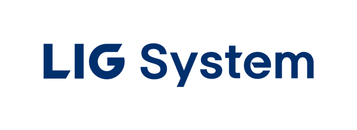

<p align="right">
  <a href="README.md">English</a> | <a href="README.ko.md">한국어</a> | <strong>中文</strong> | <a href="README.ja.md">日本語</a>
</p>

<p align="center">
  <picture>
    <source media="(prefers-color-scheme: dark)" srcset="assets/lig-system-w.png">
    
  </picture>
</p>

<h1 align="center">Vibrato</h1>

<p align="center">
  <sub>面向 Claude、OpenAI Codex 以及自托管 vLLM / SGLang 端点的终端编码代理。</sub>
</p>

<p align="center">
  <a href="https://github.com/Keonho-Chu/Vibrato"></a>
  <a href="https://www.npmjs.com/package/vib-rato"></a>
  <a href="LICENSE"></a>
</p>

> 本文档是英文 [README.md](README.md) 的翻译。如有出入，以英文版为准。

## 安装

**使用 Bun 安装** (PATH 中需要 Bun 1.4 或更高版本):

```sh
bun install -g vib-rato
vib --version
```

**独立二进制文件** (无需 Bun)，支持 Linux (x64/arm64)、macOS (arm64/x64) 和 Windows (x64):

```sh
curl -fsSL https://raw.githubusercontent.com/Keonho-Chu/Vibrato/v0.16.0/scripts/install.sh -o vib-install.sh
sh vib-install.sh
vib --version
```

Windows (PowerShell):

```powershell
Invoke-WebRequest -UseBasicParsing https://raw.githubusercontent.com/Keonho-Chu/Vibrato/v0.16.0/scripts/install.ps1 -OutFile vib-install.ps1
powershell -File vib-install.ps1
```

其他安装方式:

```sh
# 始终使用最新安装脚本 (执行 main 分支上的可变内容)
curl -fsSL https://raw.githubusercontent.com/Keonho-Chu/Vibrato/main/scripts/install.sh | sh

# 就地更新现有安装
vib update
```

完整平台列表、nightly 渠道、Shell 补全和源码构建: [docs/install.md](docs/install.md)。

## 首次运行

在任意 git 检出目录中运行 `vib`。首次启动且未配置任何提供商时，Vibrato 会自动打开提供商菜单。随时可用 `/provider` 打开同一菜单。

- **vLLM / SGLang** (自托管，兼容 OpenAI): 选择 *Connect a vLLM endpoint* 或 *Connect an SGLang endpoint*，输入服务器 URL 和可选的 API 密钥，Vibrato 会从服务器发现模型。本地无鉴权服务器可将密钥留空。
- **Claude** 或 **OpenAI Codex** (订阅计划): 运行 `/login`，选择 `anthropic`、`openai-codex` (浏览器) 或 `openai-codex-device` (无头模式)。

在 Shell 中完成同样的设置:

```sh
vib setup provider --preset vllm --base-url http://HOST:8000/v1      # 密钥来自 VLLM_API_KEY (如有)
vib setup provider --preset sglang --base-url http://HOST:30000/v1   # 密钥来自 SGLANG_API_KEY (如有)
```

localhost、私有网络主机以及 `.local` / `.internal` / `.lan` 名称允许明文 `http://`；公网主机需要 `https://`。

## 使用

```sh
vib                                        # 在当前检出目录中启动交互会话
vib "列出 src/ 下所有 .ts 文件"              # 带初始提示的交互会话
vib @prompt.md @screenshot.png "解释一下"    # 用 @ 附加文件或图片
vib -p "总结这个仓库"                        # 非交互: 输出答案后退出
vib --continue                             # 继续上一个会话
vib --resume                               # 选择更早的会话
vib --worktree my-task                     # 在隔离的 git worktree 中工作
vib --tmux                                 # 在 tmux 会话中运行
vib --model opus "重构这个模块"               # 按模糊名称选择模型
vib --list-models                          # 显示可用模型
```

会话内命令:

| 命令 | 作用 |
| :--- | :--- |
| `/provider` | 连接 vLLM 或 SGLang 端点 |
| `/login` | 登录 Claude 或 OpenAI Codex |
| `/model` | 切换当前模型 |
| `/theme` | 切换 TUI 主题 |
| `/skill:deep-interview` | 规划前澄清模糊需求 |
| `/skill:ralplan` | 修改文件前制定并评审计划 |
| `/help` | 列出所有斜杠命令 |

常用 CLI 命令:

```sh
vib --help                  # 所有参数
vib setup --help            # 提供商与凭据设置
vib customize doctor        # 诊断工具、技能、钩子或 MCP 服务器为何未加载
vib config set <key> <val>  # 在 Shell 中修改设置
vib update                  # 更新到最新版本
```

深色终端的默认 TUI 主题是应用 LIG System 企业识别的 `lig-blue`，浅色终端默认使用内置的 `lig-white`。显式的主题设置始终优先。

## 文档

- [安装、更新渠道、平台说明](docs/install.md)
- [模型、提供商与认证](docs/models.md)
- [自定义提供商与多账户路由](docs/custom-providers-and-multi-account.md)
- [技能](docs/skills.md)
- [设计系统](docs/design-system.md)
- [代码库概览](docs/codebase-overview.md) 以及 [docs/](docs/) 中的其他文档

## 许可证

MIT。参见 [LICENSE](LICENSE)。历史署名见 [NOTICE.md](NOTICE.md)。
